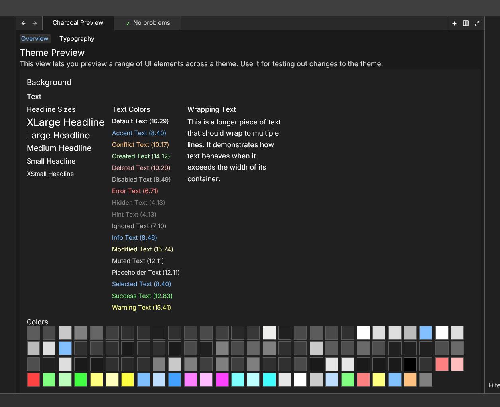
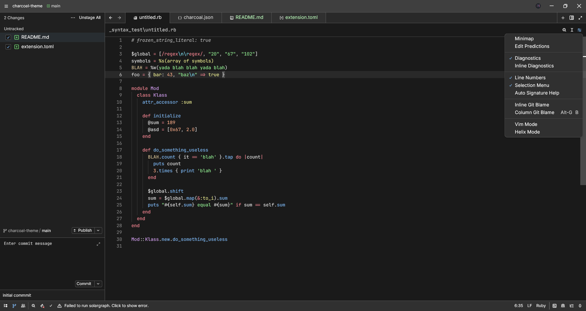
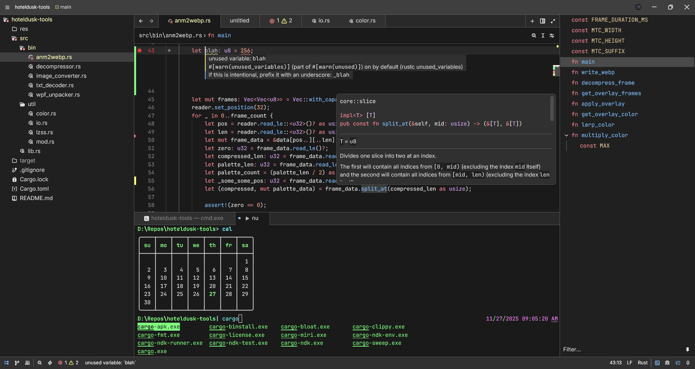
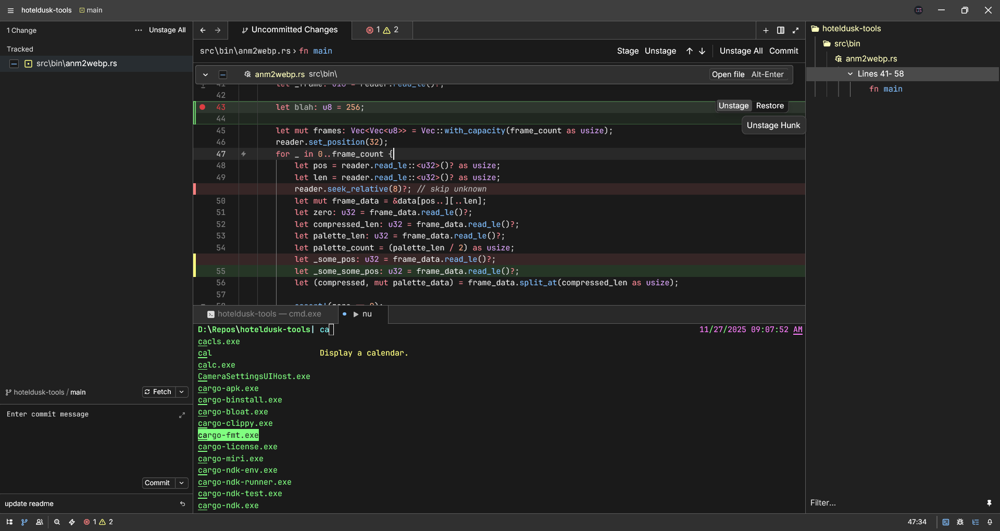
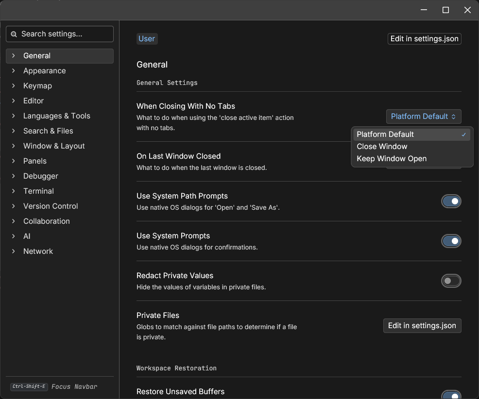
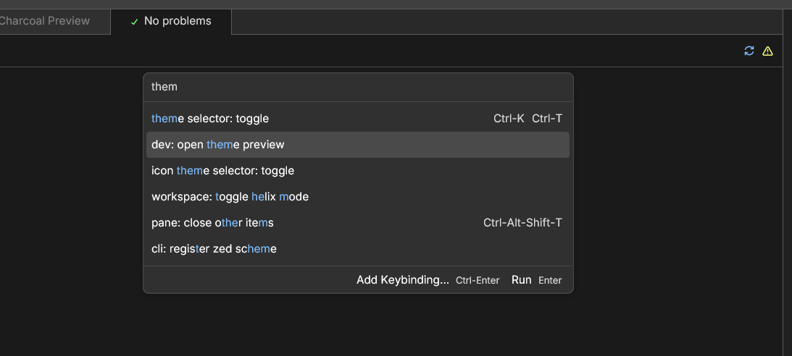

# Charcoal Theme

A sleek, dark theme for the [Zed editor](https://zed.dev), designed for those who always keep their screen brightness very low

- gray color without blue-ish/green-ish/red-ish tints
- simple, unfiltered colors for syntax highlighting
- high-constrast syntax colors that remain readable even at dim brightness

## Preview

 
<strong>more screenshots</strong>

## License

MIT License - see [LICENSE](LICENSE) for details.
